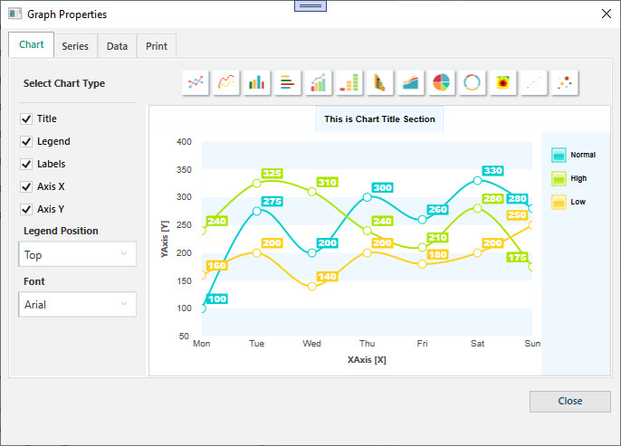
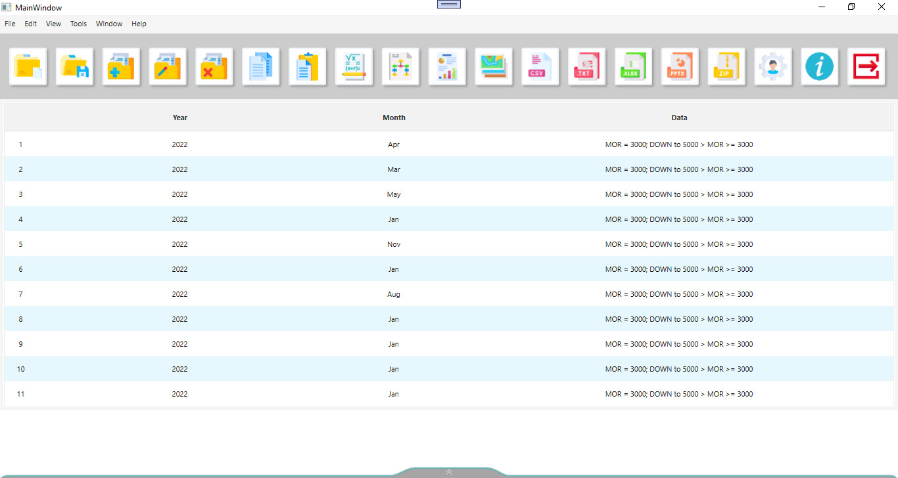

## Form Images

  <table style="padding: 0; border=0;">

    <tr valign="top"></tr>
    <tr valign="top"></tr>

  
  
    <tr valign="top"></tr>
    <tr valign="top"></tr>
  
  
   
      <tr valign="top"></tr>
      <tr valign="top"></tr>

    
      <tr valign="top" colspan="2"></tr>

 
      <tr valign="top"></tr>
      <tr valign="top"></tr>

 </table>
