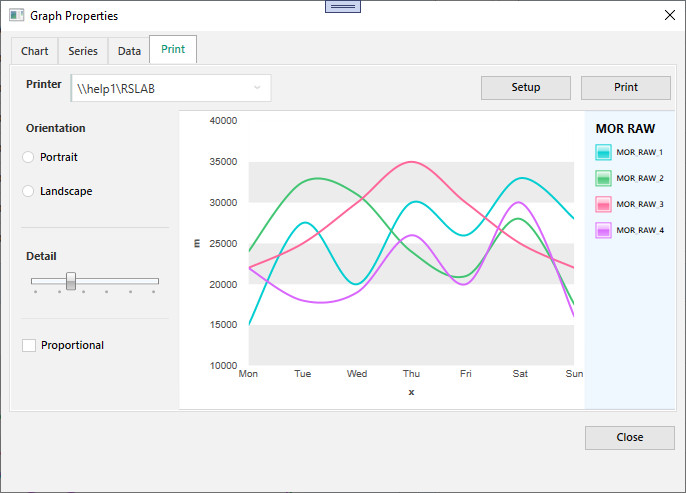
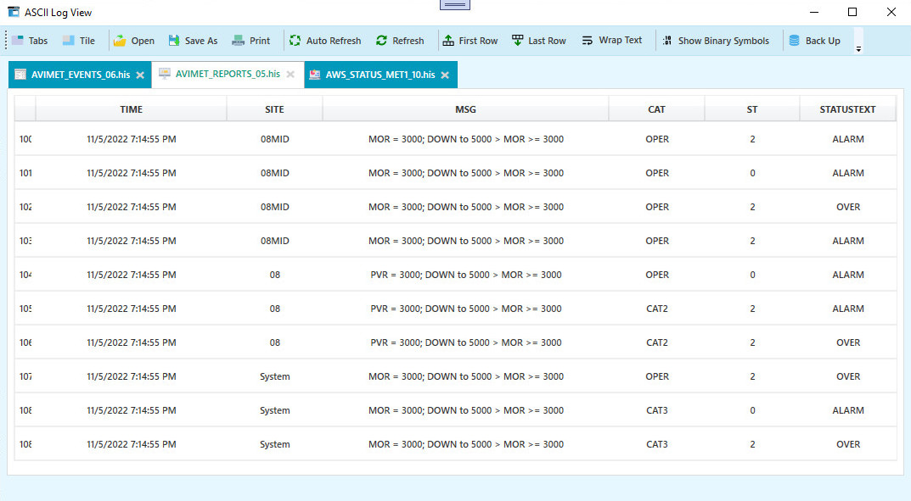

## Form Images

  <table style="padding: 0; border=0;">

  <tr>
    <td valign="top"></td>
  </tr>
  
  <tr>
    <td valign="top"></td>
  </tr>
  
  <tr>
    <td valign="top"></td>
  </tr>
  
  <tr>
    <td valign="top"></td>
  </tr>

  <tr>
    <td valign="top"></td>
  </tr>
  
  
 
 </table>
